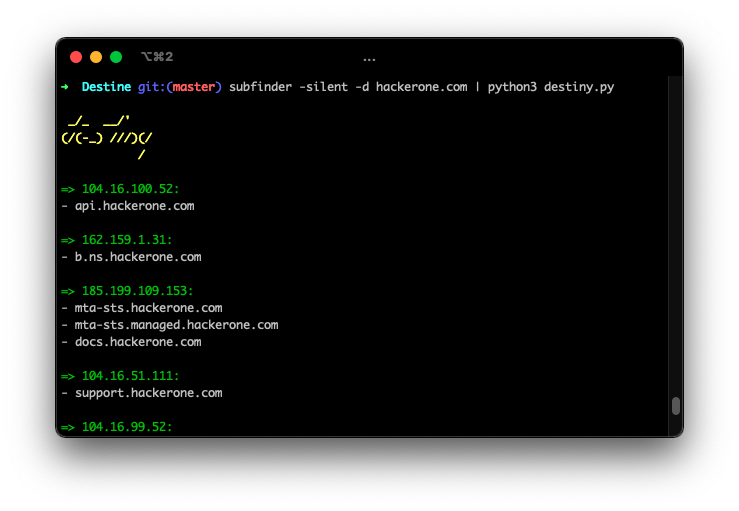

# <p align="center" width="100px" heigth="100px"></p>

### RUN

> Install
```
pipx install git+https://github.com/phor3nsic/Destiny
```

> Simple Run
```
cat hosts.txt | destiny
```

> Tool integrations

_For Subdomains:_

```
subfinder -d hackerone.com -silent | destiny
```

_For vhosts:_
```
subfinder -d hackerone.com -silent | httpx -vhost -silent| grep vhost| awk -F ' ' '{print $1}'| awk -F 'https://' '{print $2}'| destiny
```


